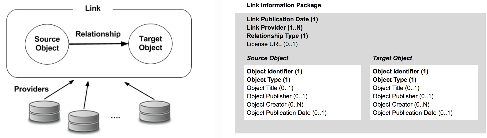

# Scholix metadata schema for exchange of scholarly links
The aim of the Scholix initiative is to find consensus on solutions to facilitate the exchange of information about semantic links between datasets and literature objects, key for reusability and reproducibility of science. The key outcome of this work,  resulting from a collaboration between academic institutions, research institutions, scholarly communication service providers, and publishers, is the Scholix metadata schema, a data model that aims at capturing the fundamental concepts underlying a relationship between two objects as sketched in Figure 1.  The molding principles of the data model were a good trade-off between:
- lightweight metadata, i.e. data model includes a set of properties that are common to all use-case scenarios and disciplines;
- optimal consumption, i.e. data model includes a set of properties that do not require reification via PID of the object and ensure straightforward reuse in most use-cases;
- collect provenance, i.e. data model includes properties to describe the provenance of the link metadata.

# Scholix Schema
The Scholix metadata schema is a set of properties describing a Link Information Package, which carries information about a link between two scholarly communication objects.

The schema follows the specification provided at https://docs.google.com/document/d/1gucw5QDSpad9r-kSSfAC6-CKi9p-f8txi3gZS6XkbZ8/edit
